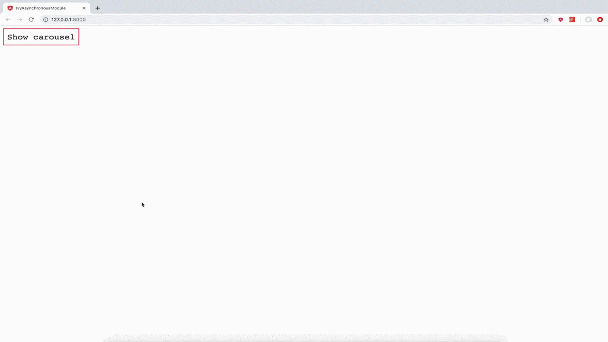

# Loading module asynchronously in Angular Ivy

This small project shows an approach of how to work with asynchronous modules in Angular Ivy.

## How to run the application?

Install dependencies:

```console
yarn --pure-lockfile
```

Then build production bundles:

```console
yarn build:prod
```

Serve `dist` folder via `http-server`:

```console
yarn serve:prod
```


